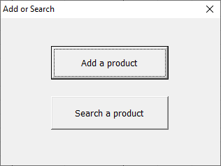
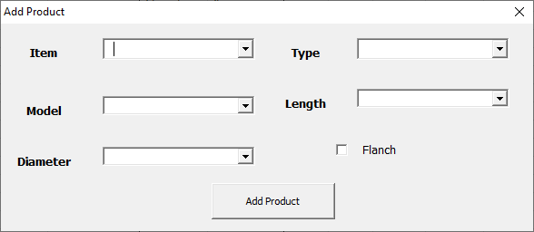
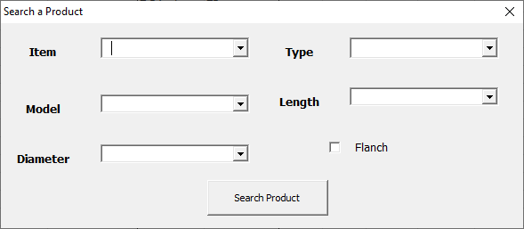

# Add-Or-Search-Product
#### An Excel VBA Macro Enabled file used to add or search any _sanitary_ product that is mentioned in a separate sheet. 
> Made for in-house use

It contains a file named .

This macro has 3 UserForms and 5 Modules.

## UserForms

1. **AddOrSearch_Ufm** :

2. **AddProduct_Ufm** :

3. **Search_Ufm** :

## Modules

1. **Update_Mod.bas** : It contains subroutines that update *ComboBox* in above mentioned forms with the data given in`Data` worksheet.
2. **GenerateCode_Mod.bas** : It has function which is used to *generate a unique code* according to the product specifications that are mentioned by user with the help of data given in `Data` worksheet..
3. **AddProduct_Mod.bas** : It contains two functions for *Adding Product* to `Products` worksheet and for *Searching Product* from `Products` worksheet.
4. **fitAndFormat_Mod.bas** : It contains a function that auto-fit all cells in the worksheet and change the formatting of the first row as specified.

